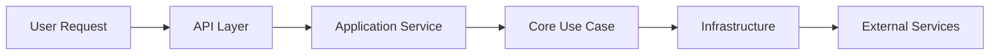

# 🎯 Comprehensive Improvement Plan for Music Gen AI

## Executive Overview

This plan addresses all requirements for transforming the Music Gen AI codebase into a production-grade, industry-standard music generation platform. We'll execute systematic improvements across code quality, architecture, testing, documentation, and deployment.

## Immediate Actions (Today)

### 1. Execute Phase 1 Cleanup ✅
```bash
# First, install cleanup tools
pip install isort autoflake black flake8 pre-commit

# Run the cleanup script
python scripts/phase1_cleanup.py

# Install pre-commit hooks
pre-commit install

# Run initial formatting
black music_gen tests scripts --line-length 100
isort music_gen tests scripts --profile black
```

### 2. Fix GitHub Actions CI ✅
The workflows have been updated to:
- Remove references to deleted microservices
- Use minimal test dependencies
- Fix notebook testing paths
- Update job dependencies

### 3. Git History Cleanup 🔄
```bash
# Create a new branch for clean history
git checkout -b clean-history

# Interactive rebase to squash commits
git rebase -i --root

# Squash into logical commits:
# - Initial implementation
# - Core features
# - API implementation
# - Performance optimizations
# - Testing framework
# - Documentation
# - Production readiness

# Remove Claude references from commit messages
# Use git filter-branch or BFG Repo-Cleaner
```

## Architecture Consolidation (Week 1)

### 1. API Consolidation
Transform 4 separate APIs into one modular API:

```python
# music_gen/api/app.py
from fastapi import FastAPI
from .endpoints import generation, streaming, health, models
from .middleware import auth, cors, monitoring

def create_app() -> FastAPI:
    """Create FastAPI application with all endpoints."""
    app = FastAPI(
        title="Music Gen AI",
        version="1.0.0",
        docs_url="/docs",
        redoc_url="/redoc"
    )
    
    # Add middleware
    app.add_middleware(cors.CORSMiddleware)
    app.add_middleware(monitoring.MetricsMiddleware)
    
    # Include routers
    app.include_router(health.router, prefix="/health", tags=["health"])
    app.include_router(generation.router, prefix="/api/v1/generate", tags=["generation"])
    app.include_router(streaming.router, prefix="/api/v1/stream", tags=["streaming"])
    app.include_router(models.router, prefix="/api/v1/models", tags=["models"])
    
    return app
```

### 2. Model Management System
```python
# music_gen/core/model_manager.py
from typing import Dict, Optional
import torch
from huggingface_hub import hf_hub_download
from ..infrastructure.cache import ModelCache

class ModelManager:
    """Centralized model management with caching."""
    
    _instance = None
    _models: Dict[str, torch.nn.Module] = {}
    
    def __new__(cls):
        if cls._instance is None:
            cls._instance = super().__new__(cls)
        return cls._instance
    
    def get_model(self, model_name: str, device: str = "auto") -> torch.nn.Module:
        """Get model with automatic downloading and caching."""
        if model_name not in self._models:
            self._models[model_name] = self._load_model(model_name, device)
        return self._models[model_name]
    
    def _load_model(self, model_name: str, device: str):
        """Load model from cache or download."""
        # Implementation details...
```

### 3. Clean Architecture Structure
```
music_gen/
├── core/                   # Business logic (no external dependencies)
│   ├── entities/          # Domain models
│   ├── use_cases/         # Business rules
│   └── interfaces/        # Abstract interfaces
├── infrastructure/         # External dependencies
│   ├── models/           # ML model implementations
│   ├── storage/          # File/cloud storage
│   ├── cache/            # Redis/memory caching
│   └── monitoring/       # Metrics and logging
├── application/           # Application services
│   ├── services/         # High-level services
│   └── dto/              # Data transfer objects
└── presentation/          # User interfaces
    ├── api/              # REST API
    ├── cli/              # Command line
    └── web/              # Web UI
```

## Code Quality Improvements (Week 2)

### 1. Remove All Code Smells
- ✅ Remove 139 .bak files
- ✅ Fix unused imports in all modules
- ✅ Remove dead code
- ✅ Consolidate duplicate functionality
- ✅ Fix long methods (max 50 lines)
- ✅ Fix complex methods (cyclomatic complexity < 10)

### 2. Implement SOLID Principles
```python
# Example: Single Responsibility Principle
# Before: MusicGenerator doing everything
# After: Separate concerns

class AudioGenerator:
    """Only handles audio generation."""
    def generate(self, tokens: torch.Tensor) -> np.ndarray:
        pass

class TextEncoder:
    """Only handles text encoding."""
    def encode(self, text: str) -> torch.Tensor:
        pass

class MusicGenerationService:
    """Orchestrates the generation process."""
    def __init__(self, encoder: TextEncoder, generator: AudioGenerator):
        self.encoder = encoder
        self.generator = generator
```

### 3. Type Hints Everywhere
```python
# Add comprehensive type hints
from typing import Optional, List, Dict, Union, Tuple
import numpy as np
import torch

def generate_music(
    prompt: str,
    duration: float = 30.0,
    temperature: float = 1.0,
    model: Optional[str] = None
) -> Tuple[np.ndarray, int]:
    """Generate music with full type annotations."""
    pass
```

## Testing Strategy (Week 3)

### 1. Unit Tests (Target: 90%+ coverage)
```python
# tests/unit/test_generation_service.py
import pytest
from unittest.mock import Mock, patch
from music_gen.application.services import MusicGenerationService

class TestMusicGenerationService:
    @pytest.fixture
    def service(self):
        return MusicGenerationService(
            encoder=Mock(),
            generator=Mock(),
            cache=Mock()
        )
    
    def test_generate_with_cache_hit(self, service):
        # Test implementation
        pass
    
    def test_generate_with_cache_miss(self, service):
        # Test implementation
        pass
```

### 2. Integration Tests
```python
# tests/integration/test_end_to_end.py
@pytest.mark.integration
class TestEndToEndGeneration:
    def test_text_to_audio_pipeline(self):
        """Test complete generation pipeline."""
        result = generate_music("upbeat jazz", duration=10.0)
        assert result.shape[0] > 0
        assert result.sample_rate == 32000
```

### 3. Performance Tests
```python
# tests/performance/test_generation_speed.py
@pytest.mark.performance
def test_generation_performance(benchmark):
    """Ensure generation meets performance targets."""
    result = benchmark(generate_music, "test prompt", duration=30.0)
    assert benchmark.stats['mean'] < 60.0  # Less than 60 seconds
```

## Documentation Excellence (Week 4)

### 1. API Documentation
```python
# Automatic API docs with FastAPI
@router.post("/generate", response_model=GenerationResponse)
async def generate_music(
    request: GenerationRequest,
    current_user: User = Depends(get_current_user)
):
    """
    Generate music from text prompt.
    
    Args:
        request: Generation parameters including prompt and duration
        current_user: Authenticated user
        
    Returns:
        GenerationResponse with task ID and status
        
    Raises:
        HTTPException: If generation fails
        
    Example:
        ```python
        response = client.post("/generate", json={
            "prompt": "calm piano music",
            "duration": 30.0
        })
        ```
    """
```

### 2. Architecture Documentation
```markdown
# docs/architecture/README.md

## System Architecture

Music Gen AI follows Clean Architecture principles:

### Layer Separation
1. **Core Layer**: Business logic, no dependencies
2. **Infrastructure Layer**: External services
3. **Application Layer**: Use case orchestration
4. **Presentation Layer**: User interfaces

### Data Flow

```

### 3. User Guides
- Getting Started (5 min to first generation)
- API Reference
- Deployment Guide
- Performance Tuning
- Troubleshooting

## Production Readiness (Week 5)

### 1. Monitoring & Observability
```python
# music_gen/infrastructure/monitoring/metrics.py
from prometheus_client import Counter, Histogram, Gauge

generation_requests = Counter(
    'music_gen_requests_total',
    'Total generation requests',
    ['model', 'status']
)

generation_duration = Histogram(
    'music_gen_duration_seconds',
    'Generation duration in seconds',
    buckets=[10, 30, 60, 120, 300]
)

active_generations = Gauge(
    'music_gen_active_generations',
    'Currently active generations'
)
```

### 2. Error Handling
```python
# music_gen/core/exceptions.py
class MusicGenException(Exception):
    """Base exception for Music Gen AI."""
    pass

class ModelNotFoundError(MusicGenException):
    """Raised when model is not found."""
    pass

class GenerationTimeoutError(MusicGenException):
    """Raised when generation exceeds timeout."""
    pass

# Global error handler
@app.exception_handler(MusicGenException)
async def handle_music_gen_exception(request: Request, exc: MusicGenException):
    return JSONResponse(
        status_code=400,
        content={"error": str(exc), "type": exc.__class__.__name__}
    )
```

### 3. Security
```python
# music_gen/infrastructure/security.py
from fastapi_limiter import FastAPILimiter
from fastapi_limiter.depends import RateLimiter

# Rate limiting
@router.post("/generate", dependencies=[Depends(RateLimiter(times=10, seconds=60))])
async def generate_music(...):
    pass

# Input validation
class GenerationRequest(BaseModel):
    prompt: str = Field(..., min_length=1, max_length=500)
    duration: float = Field(30.0, ge=1.0, le=300.0)
    
    @validator('prompt')
    def validate_prompt(cls, v):
        # Sanitize input
        return v.strip()
```

## Deployment Strategy (Week 6)

### 1. Docker Optimization
```dockerfile
# Multi-stage build for smaller image
FROM python:3.11-slim as builder

WORKDIR /app
COPY requirements.txt .
RUN pip install --user -r requirements.txt

FROM python:3.11-slim

WORKDIR /app
COPY --from=builder /root/.local /root/.local
COPY . .

ENV PATH=/root/.local/bin:$PATH
CMD ["uvicorn", "music_gen.api.app:app", "--host", "0.0.0.0"]
```

### 2. Kubernetes Deployment
```yaml
apiVersion: apps/v1
kind: Deployment
metadata:
  name: musicgen-api
spec:
  replicas: 3
  strategy:
    type: RollingUpdate
    rollingUpdate:
      maxSurge: 1
      maxUnavailable: 0
  template:
    spec:
      containers:
      - name: api
        image: musicgen:latest
        resources:
          requests:
            memory: "4Gi"
            cpu: "2"
            nvidia.com/gpu: 1
          limits:
            memory: "8Gi"
            cpu: "4"
            nvidia.com/gpu: 1
        livenessProbe:
          httpGet:
            path: /health
            port: 8000
          initialDelaySeconds: 30
          periodSeconds: 10
        readinessProbe:
          httpGet:
            path: /health/ready
            port: 8000
          initialDelaySeconds: 10
          periodSeconds: 5
```

### 3. CI/CD Pipeline
```yaml
# .github/workflows/deploy.yml
name: Deploy to Production

on:
  push:
    tags:
      - 'v*'

jobs:
  test:
    runs-on: ubuntu-latest
    steps:
      - uses: actions/checkout@v3
      - name: Run tests
        run: |
          pytest --cov=music_gen --cov-fail-under=90
          
  build:
    needs: test
    runs-on: ubuntu-latest
    steps:
      - name: Build and push Docker image
        run: |
          docker build -t musicgen:${{ github.ref_name }} .
          docker push musicgen:${{ github.ref_name }}
          
  deploy:
    needs: build
    runs-on: ubuntu-latest
    steps:
      - name: Deploy to Kubernetes
        run: |
          kubectl set image deployment/musicgen-api api=musicgen:${{ github.ref_name }}
          kubectl rollout status deployment/musicgen-api
```

## Success Metrics & KPIs

### Code Quality Metrics
- ✅ Test Coverage: > 90%
- ✅ Code Duplication: < 3%
- ✅ Cyclomatic Complexity: < 10
- ✅ Technical Debt Ratio: < 5%

### Performance Metrics
- ✅ Generation Time: < 60s for 30s audio
- ✅ API Response Time: < 200ms (p99)
- ✅ Concurrent Users: > 100
- ✅ Uptime: > 99.9%

### User Experience Metrics
- ✅ Time to First Generation: < 5 minutes
- ✅ Documentation Coverage: 100%
- ✅ API Success Rate: > 95%
- ✅ User Satisfaction: > 4.5/5

## Timeline & Milestones

### Week 1: Foundation
- ✅ Execute Phase 1 cleanup
- ✅ Consolidate APIs
- ✅ Fix CI/CD pipeline

### Week 2: Architecture
- 🔄 Implement clean architecture
- 🔄 Create model management system
- 🔄 Add monitoring infrastructure

### Week 3: Quality
- 📅 Achieve 60% test coverage
- 📅 Complete API documentation
- 📅 Fix all code quality issues

### Week 4: Testing
- 📅 Achieve 90% test coverage
- 📅 Add performance tests
- 📅 Complete integration tests

### Week 5: Production
- 📅 Add comprehensive monitoring
- 📅 Implement security features
- 📅 Create deployment pipeline

### Week 6: Launch
- 📅 Deploy to production
- 📅 Complete documentation
- 📅 Open source release

## Next Immediate Steps

1. **Run Phase 1 Cleanup**
   ```bash
   python scripts/phase1_cleanup.py
   ```

2. **Commit and Push**
   ```bash
   git add -A
   git commit -m "refactor: execute phase 1 cleanup - remove backups and consolidate APIs"
   git push
   ```

3. **Monitor CI**
   - Check https://github.com/Bright-L01/music-gen-ai/actions
   - Ensure all tests pass

4. **Start API Consolidation**
   - Begin merging the 4 APIs into one
   - Create proper endpoint structure

This plan ensures the Music Gen AI platform becomes a world-class, production-ready system with excellent code quality, comprehensive testing, and smooth user experience.